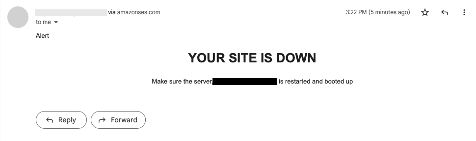

# py_health_check_tool
A simplistic and handy tool to check the health status of your microservices, sites or your servers


Table of contents
=================

<!--ts-->
   * [Requirements](#requirements)
   * [Installation](#installation)
   * [Usage](#usage)
      * [Environment variables](#Environment_Variables)
      * [Host Configuration](#Host_Configuration)
      * [Heartbeat limit Configuration](#Heartbeat_limit_Configuration)
   * [Screenshots](#screenshots)
   * [FAQS](#faqs)

<!--te-->

Requirements
====

- Python3 installed
- Pip installed
- Programmatic access to aws for development purposes only. (For production usage, use instance role). Visit https://docs.aws.amazon.com/IAM/latest/UserGuide/id_users_create.html for details in setting up a user with access
- If successful, you should also have aws cli installed on your machine
- Create SES email record to send email on your behalf. This requires verifying the email when created.  

Installation
=====

-   Upgrade pip `python3 -m pip install --user --upgrade pip`
-   Install virtualenv `python3 -m pip install --user virtualenv`
-   Create virtual environment `python3 -m venv venv`
-   Activate environmnet `source venv/bin/activate`
-   Install dependencies `python3 -m pip install -r requirements.txt`
-   Rename env file `mv .example-env .env`

<br>

Usage
=====
### Environment_Variables

<br>

| Variable | Description | Required |
| --- | --- | --- |
| AWS_REGION | Your aws region eg: us-east-2, us-wast-1 | [x] |
| AWS_ACCESS_KEY_ID | Aws access key id | [x] |
| AWS_SECRET_ACCESS_KEY | List all new or modified files | [x] |
| WAIT_SECONDS |  | |
| WAIT_FACTOR |  | |
| EMAIL_SOURCE | Email must match your SES record on AWS | [x] |
| EMAIL_TO_ADDRESS | Email to alert you on downtimes | [x] |


<br>

### Host_Configuration

<br>
In the hosts.ini define the websites, services (called hosts) in the host section. 
Format: 


```
[hosts]

host1 = http://{host1}

host2 = http://{host2}

```


Perfact example of the hosts section is 


```
[hosts]

facebook = http://facebook.com 

my-website = http://my-website.com

```

### Heartbeat_limit_Configuration

It is the how many times to check for 200 status after a failed response before alerting you about the downtime.
It has an exponential backoff with increased heart_beat_limit to create enough grace period for your host or service.


```
[heart_beat_limit]

host1 = 1

host2 = 3

```

Perfact example of the hosts section is 

```

[heart_beat_limit]

facebook = 1

my-website = 3

```


## Ok, are we there yet?
<p>If you were able to setup this project then you can run this application</p>

-   For manual execution, `python3 main.py`

-   For cron tab configurations, add this line `5 * * * * /usr/local/bin/python3 main.py>/dev/null 2>&1` to your cron 

<br>

Screenshots
=====

Console output


This is email view of your alert when your defined host are down for whatever reason



## FAQS
-   If you already have the AWS cli installed on your machine, you donot need to specify the `AWS_ACCESS_KEY_ID` AND `AWS_SECRET_ACCESS_KEY` secret values in the .env file.